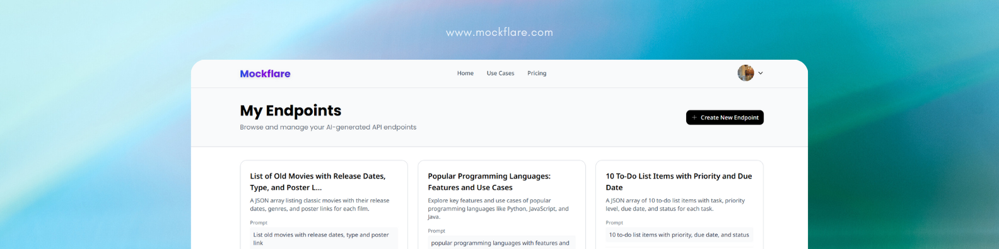
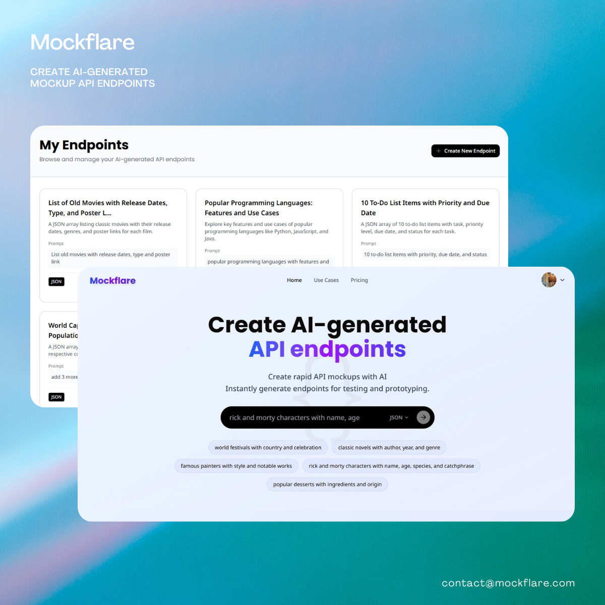

# Mockflare

⚡ **Mockflare** helps frontend developers move faster by generating **AI-powered mock APIs** in seconds.  
No more waiting for the backend team — create endpoints, share them with your team, and keep building smoothly.

---

## 🌐 Live Demo
👉 [Visit Mockflare.com](https://mockflare.com)

---

## 🚀 What is Mockflare?
Mockflare is a developer tool that allows you to:
- Generate mock APIs instantly with AI
- Share endpoints with your team
- Continue frontend development without backend delays
- Switch to real APIs later without breaking your flow

---

## 📸 Preview

---

## ℹ️ About This Repository
This repository is **for showcasing Mockflare only**.  
The source code is **not open-source** at this time.

---

## 📬 Feedback
💡 Have ideas or feedback? Feel free to open an issue or reach out at **[your email/contact link]**.
